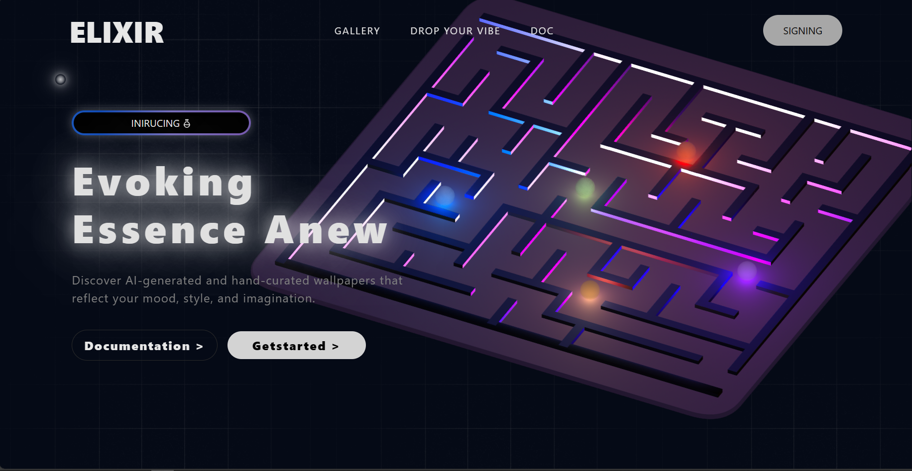

# 🌌 Elixir – Modern Wallpaper Website

Elixir is a modern and responsive wallpaper website built using the MERN stack (MongoDB, Express.js, React, Node.js). It allows users to browse, search, and download wallpapers through a clean and intuitive interface.

## 🚀 Features

🖼 Wallpaper Collection – Browse a wide range of high-quality wallpapers.
📱 Responsive UI – Fully optimized for desktop, tablet, and mobile devices.
⚡ Simple & Fast – Lightweight design with smooth performance.
🎨 User-Friendly Interface – Easy navigation with a modern look.
🔍 Search & Filter – Find wallpapers by category, color, or tags.
🤖 AI Enhancements (Planned) – AI-powered wallpaper tagging & style transfer.

## 🛠️ Tech Stack

Frontend: React.js, Tailwind CSS, DaisyUI
Backend: Node.js, Express.js
Database: MongoDB
Other Tools: Git & GitHub, npm packages

## 📸 Screenshot

⚡ Installation & Setup

### Clone the repository

git clone <https://github.com/adityasharmagit/elixirs.git>
cd elixir

### Install dependencies

npm install

### Start the backend server

cd backend
npm run dev

### Start the frontend

cd frontend
npm run dev

## 🤝 Contributing

Contributions are always welcome!

Fork the repository

Create a feature branch (git checkout -b feature-name)
Commit your changes (git commit -m "Add feature")
Push to the branch (git push origin feature-name)
Open a Pull Request

## 📜 License

This project is licensed under the MIT License.
